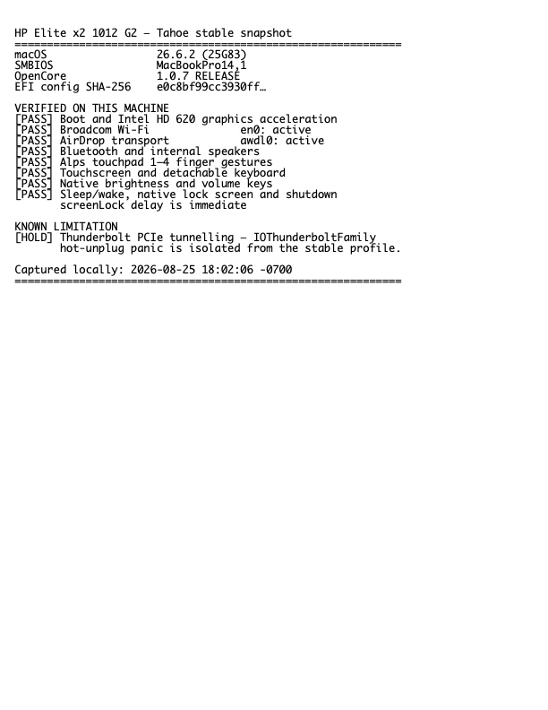

# HP Elite x2 1012 G2 Hackintosh

OpenCore configuration for the HP Elite x2 1012 G2, maintained for macOS Ventura 13.6 and macOS Tahoe 26.6.2 (25G83). The Tahoe profile below was exported from the EFI System Partition after physical-machine validation through 2026-09-27.

## Hardware

- Intel Core i7-7600U / Intel HD Graphics 620
- 16 GB RAM / 512 GB NVMe
- Broadcom BCM4360 Wi-Fi (`14E4:43A0`)
- Alps USB touchpad (`044E:1216`)
- SMBIOS: `MacBookPro14,1`
- OpenCore: 1.0.7 RELEASE

## Current status

| Feature | Ventura 13.6 | Tahoe 26.6.2 |
| --- | --- | --- |
| Boot / Intel HD 620 acceleration | Tested | Tested |
| Alps touchpad 1–4 finger gestures | Tested | Tested, including after sleep |
| Broadcom Wi-Fi | Tested | Requires OCLP-CustoMac Modern Wi-Fi root patch |
| AirDrop / AWDL | Tested on Ventura | AWDL active; two-way transfer still needs per-install validation |
| Bluetooth | Tested | Tested |
| Internal speakers / volume keys | Tested | Tested |
| Brightness keys / keyboard reconnect | Tested | Tested with native F3/F4 mapping and dock-reconnect guard |
| Sleep / wake / native wake lock | Short test passed after AlpsHID fix | Tested; immediate password lock restored |
| Shutdown / reboot | Tested | Tested with Tahoe HID termination guards |
| Thunderbolt PCIe tunnelling | Disabled | Disabled |
| USB-C USB / charging / DisplayPort Alt Mode | Separate from disabled NHI; test per device | Test per adapter; do not hot-unplug a true TB3 device |
| Keyboard wake | Power-button wake recommended | Not enabled; VoodooPS2 disables the PS/2 IRQ during sleep |
| Camera | Not enumerated | Not fixed by this EFI |

Thunderbolt NHI is intentionally blocked, its unstable ACPI hot-plug injection is disabled, and the USB-C connector is handled through mapped XHCI. `IOThunderboltFamily 9.3.3` caused reproducible page-fault panics on both Ventura and Tahoe, so this stable profile deliberately does not provide Thunderbolt PCIe tunnelling. See [Docs/Thunderbolt.md](Docs/Thunderbolt.md) before experimenting with a true TB3 device.

## Before using this EFI

The public `config.plist` is sanitized. Generate your own `MacBookPro14,1` PlatformInfo and replace all four placeholders:

- `SystemSerialNumber`
- `MLB`
- `SystemUUID`
- `ROM`

Never reuse identifiers from another machine and never publish working identifiers.

Back up the entire EFI System Partition and keep a bootable recovery USB before replacing an existing EFI. The EFI directory alone does not back up personal files and cannot downgrade a Tahoe system volume to Ventura.

## Tahoe 26.6.2 upgrade

See [Docs/Tahoe-26.6.2.md](Docs/Tahoe-26.6.2.md) for the exact transition strategy, post-install Wi-Fi patch, validation gates, known limitations, and rollback boundaries.

The bundled EFI now reflects the physically tested Tahoe installation. Machine-specific PlatformInfo values remain sanitized; Wi-Fi still depends on the matching root patch, and unsupported hardware remains subject to the limitations documented above.

## Validation

Validate `Hp Install OC/EFI/OC/config.plist` with the `ocvalidate` binary from the matching OpenCore 1.0.7 release before deploying any edit.

The file list and SHA-256 hashes for this public snapshot are recorded in `EFI-SHA256SUMS.txt`.

## Credits

- [OpenCorePkg](https://github.com/acidanthera/OpenCorePkg)
- [Dortania OpenCore Install Guide](https://dortania.github.io/OpenCore-Install-Guide/)
- [OpenCore Legacy Patcher](https://github.com/dortania/OpenCore-Legacy-Patcher)
- [OCLP-CustoMac](https://github.com/kgp-macPro/OCLP-CustoMac)
